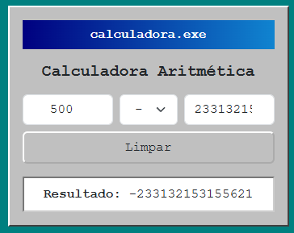

# Calculadora Vue.js

Aplicação web de calculadora aritmética desenvolvida com Vue 3, com foco em componentização e reatividade.



---

## Sobre o projeto

Projeto desenvolvido para praticar conceitos de Vue.js, incluindo reatividade, componentização e estrutura de aplicações SPA.

---

## Funcionalidades

* Operações básicas (adição, subtração, multiplicação e divisão)
* Atualização automática do resultado
* Botão de limpeza
* Interface com estilo retrô inspirado no Windows
* Estrutura organizada em componentes

---

## Tecnologias utilizadas

* Vue.js 3
* Vite
* JavaScript (ES6+)
* Bootstrap
* CSS

---

## Conceitos aplicados

* Componentização
* Reatividade
* Manipulação de eventos
* Organização de projeto frontend
* Single Page Application (SPA)

---

## Estrutura do projeto

```
src/
 ├ assets/
 │   └ style.css
 ├ components/
 │   ├ Cabecalho.vue
 │   ├ Calculadora.vue
 │   └ Resultado.vue
 ├ App.vue
 └ main.js
```

---

## Como executar o projeto

```
npm install
npm run dev
```

---

## Status

Projeto em desenvolvimento.

---

## Autor

Samuel Tonon
Estudante de Segurança da Informação
Desenvolvedor Fullstack em formação
